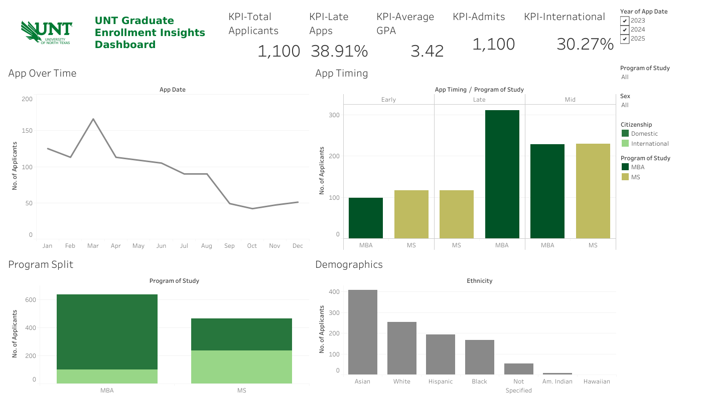

# University of North Texas Enrollment Insights
This project's mission was to deliver predictive models, an interactive dahsboard, and actionable recommendations that would enable UNT's College of Business to make data-informed decisions in regards to graduate recruitment, retention, and graduation rates. 
## Tableau Dashboard
  [UNT Dashboard](https://public.tableau.com/views/UNTDahsboardFINAL/Home?:language=en-US&:sid=&:redirect=auth&:display_count=n&:origin=viz_share_link)
### Overview

The dashboard highlights key performance indicators (KPIs) and visualizes applicant trends over time, including application timing and applicant volume by program of study and ethnicity.
### ANOVA Insights

I created this dashboard utilizting predicted probabilities from a logistic regression model to classify applicants into risk categories (low, medium, high) and visualize patterns related to late application behavior. 
## Tools Used
- R
- JMP
- SAS
- Tableau
## Full Project Report
  [UNT Admissions Reccomendation Report (Download PDF)](UNT_Admission_Reccomendation_Report.pdf)
