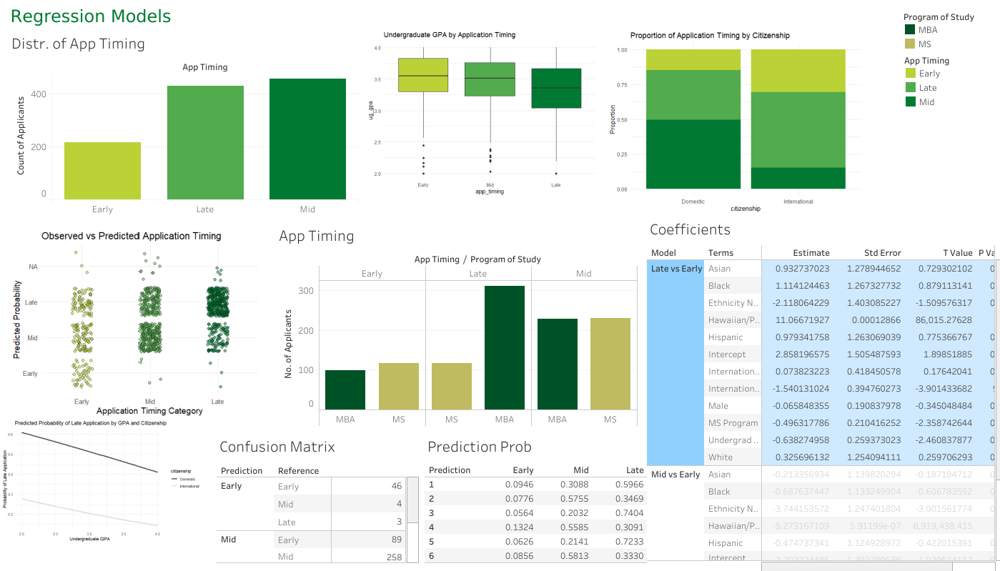
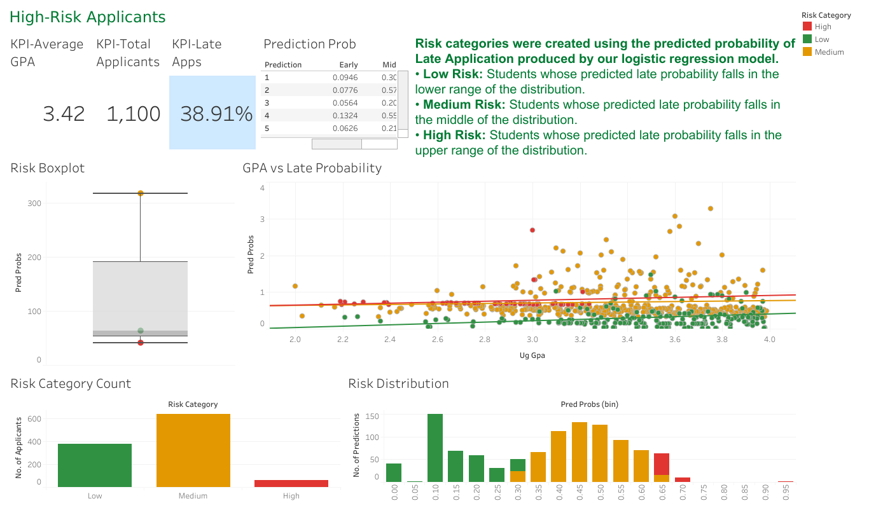

# University of North Texas Enrollment Insights
This project's mission was to deliver predictive models, an interactive dahsboard, and actionable recommendations that would enable UNT's College of Business to make data-informed decisions in regards to graduate recruitment, retention, and graduation rates. 
## Tableau Dashboard
  [UNT Public Dashboard](https://public.tableau.com/views/UNTDahsboardFINAL/Home?:language=en-US&:sid=&:redirect=auth&:display_count=n&:origin=viz_share_link) This project analyzes graduate applicant data using statistical modeling and data visualization. Predicted probabilities from a logistic regression model are used to classify applicants into risk categories (low, medium, high) and to explore patterns associated with late application behavior.

### Overview

The dashboard highlights key performance indicators (KPIs) and visualizes applicant trends over time, including application timing and applicant volume by program of study and ethnicity.
### ANOVA Visualization

This dashboard presents ANOVA findings comparing undergraduate GPA across application timing groups. The analysis highlights statistically significant differences (p < 0.001) and explores GPA variation by ethnicity and sex to contextualize applicant performance patterns.
### Regression Model Visualization

This dashboard presents logistic regression results modeling application timing (early, mid, late) as a function of applicant variables. Visualizations compare observed versus predicted outcomes, display predicted probabilities, and summarize model coefficients, performance metrics, and classification results.
### Risk Analysis

This dashboard uses predicted probabilities from a logistic regression model to classify applicants into low, medium, and high-risk groups based on the likelihood of late application. It highlights important KPIs, risk distributions, and the relationship between undergraduate GPA and predicted late-application probability to support early identification and targeted outreach.
## Tools Used
- R
- JMP
- SAS
- Tableau
## Full Project Report
  [UNT Admissions Reccomendation Report (Download PDF)](UNT_Admission_Reccomendation_Report.pdf)
